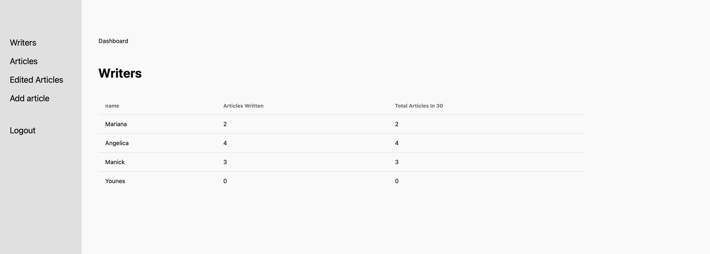

# Blog Application

Welcome to the **Blog Application**! This project demonstrates the capabilities of a blog platform built with Django for the backend and  React for the frontend.

---

## Table of Contents

1. [Project Overview](#project-overview)
2. [Features](#features)
3. [Setup Instructions](#setup-instructions)
4. [Makefile Commands](#makefile-commands)
5. [Docker and Kubernetes (Optional)](#docker-and-kubernetes-optional)
6. [Frontend (Optional - React)](#frontend-optional---react)
7. [Screenshots](#screenshots)
8. [Testing](#testing)

---

## Project Overview

This is a **Blog Application** designed to allow writers and editors to manage articles effectively. The application implements core Django features such as authentication, class-based views, and model relationships, while adhering to Django and Python best practices. Editors can approve or reject articles, and writers can create and edit their articles.

---

## Features

- **Dashboard**: Displays a summary of writers and the number of articles they’ve written.
- **Article Management**: Writers can create, edit, and submit articles.
- **Article Approval**: Editors can review and approve or reject submitted articles.
- **Writer Article Detail Page**: can edit title or/and content of an article

---

## Setup Instructions

1. **Clone the repository:**
    ```bash
    git clone https://github.com/yourusername/blog-application
    cd blog-application
    ```

2. **Install dependencies:**
    ```bash
    pip install -r requirements.txt
    ```

3. **Run the application:**
    ```bash
    python manage.py runserver
    ```

---

## Makefile Commands

Use the following Makefile commands to manage the project easily:

- `make runserver` - Starts the Django development server.
- `make test` - Runs all tests for the application.

---

## Docker and Kubernetes (Optional)

You can containerize the application using Docker. For Kubernetes, deploy using the provided YAML files.

---

## Frontend (Optional - React)

the frontend of this project is implemented using reactjs 
---

## Screenshots

Here are some screenshots showing the key pages of the application:

- **Dashboard statistics :**
  

- **Article Creation:**
  

- **Article Approval:**
  

- **Writer Article Detail Page:**
  

- **Articles Edited Page :**
  


---

## Testing

Run the test suite using:

```bash
python manage.py test
